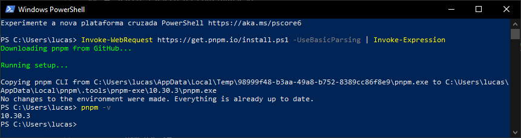
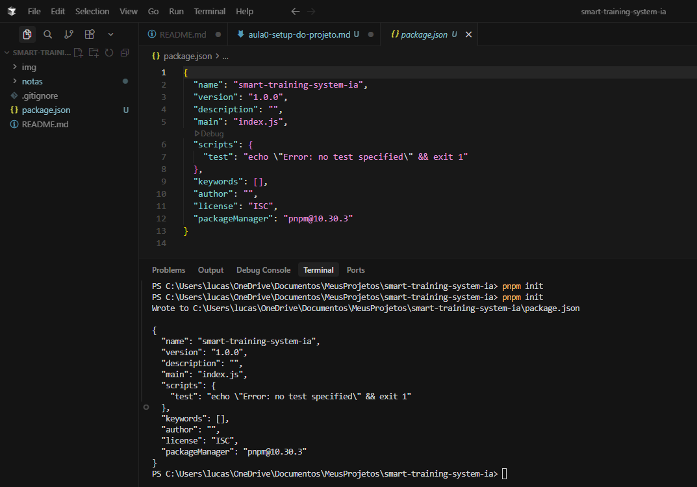
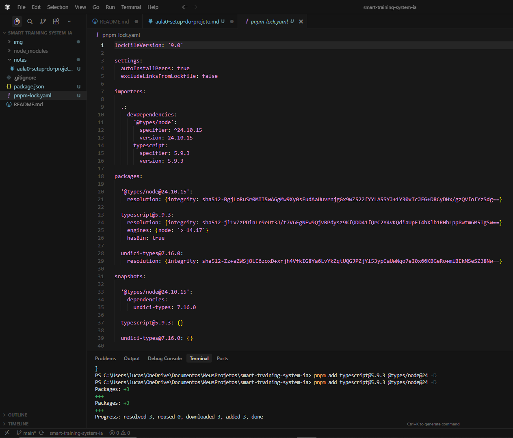
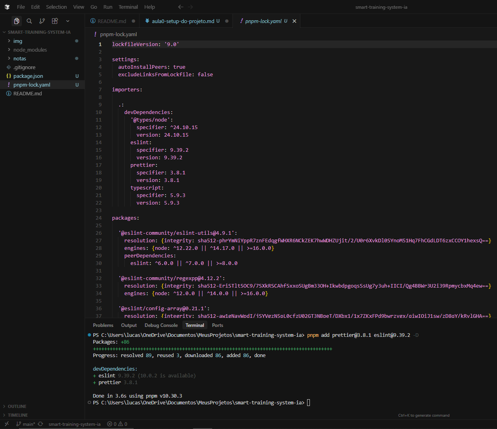
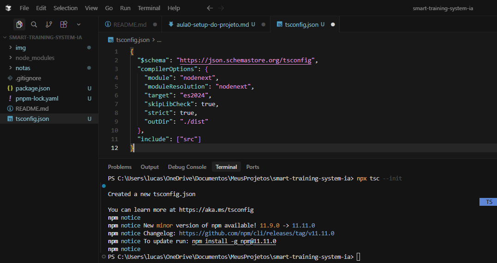
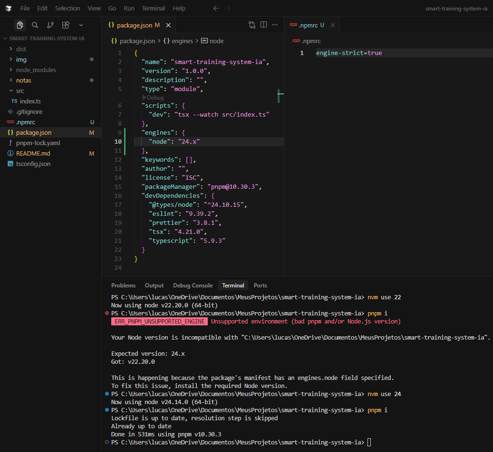
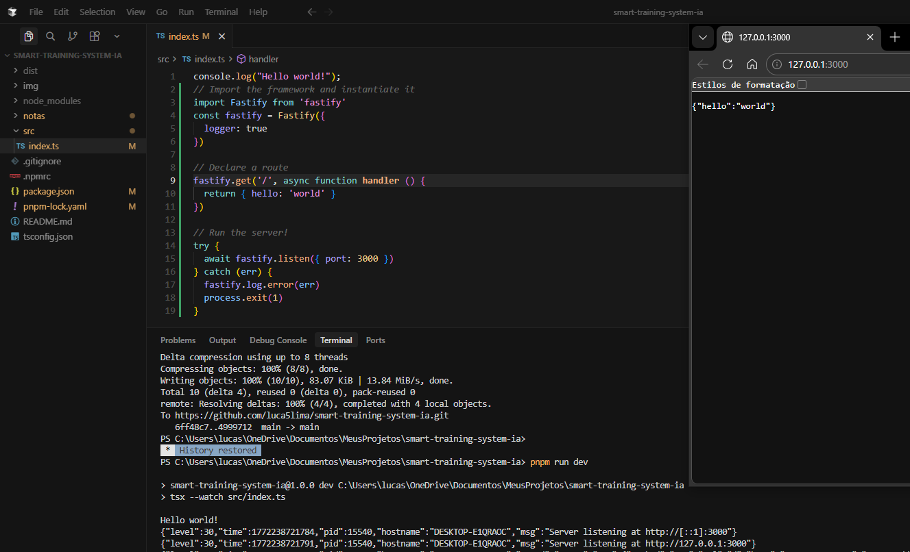
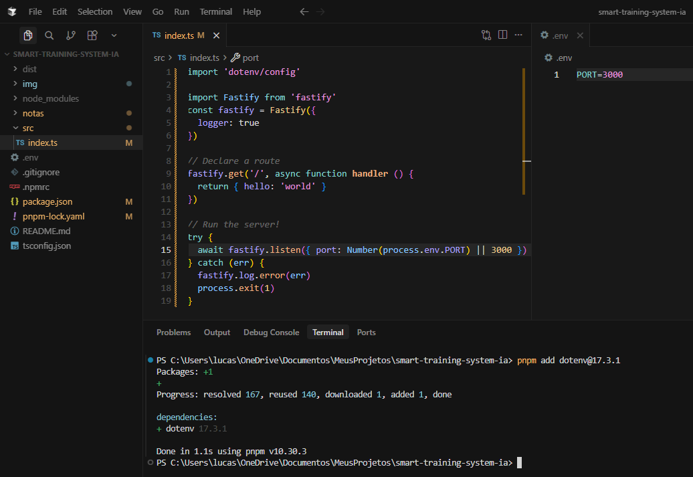
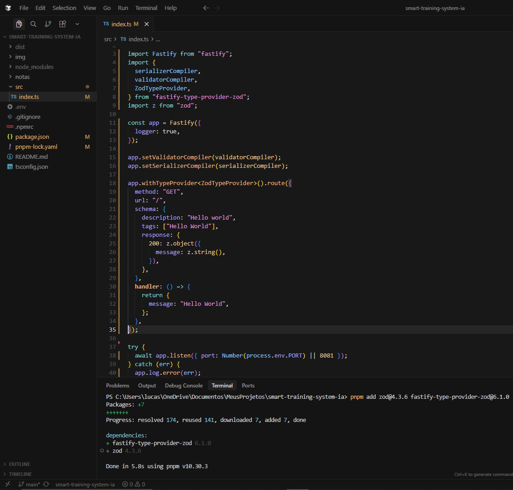

# 🛠️ Log de Engenharia #Aula0: Setup do Ambiente e Estrutura Base

Nesta etapa inicial, foquei na preparação do ambiente de desenvolvimento para garantir uma base sólida, performática e tipada para o **Fit.AI**. Optei pelo ecossistema moderno de Node.js com TypeScript e `pnpm`.

## ⚙️ Stack de Desenvolvimento
- **Gerenciador de Versão:** [NVM-Windows](https://github.com/coreybutler/nvm-windows) (Node v24.x)
- **Gerenciador de Pacotes:** `pnpm` (pela eficiência em disco e velocidade)
- **Linguagem:** TypeScript 5.9.3 (Strict Mode)
- **Runtime de Desenvolvimento:** `tsx` para execução rápida sem transpilação manual.

## 🚀 Passo a Passo da Configuração
### 1. Gerenciamento de Versão com NVM
Para evitar conflitos de versões entre diferentes projetos, utilizei o nvm-windows para instalar e gerenciar o Node.js.
Isso garante que o projeto utilize o Node v24, versão recomendada para as funcionalidades de IA que iremos implementar.
Asista o [Video](https://www.youtube.com/watch?v=zKTAYbcHob0) para entender como intalar **nvm** pelo [Site](https://github.com/coreybutler/nvm-windows/releases)
- Instalação da versão específica: 
    ```bash
        nvm install 24
    ```
- Ativação da versão para o projeto:
    ```Bash
        nvm use 24
    ```
- Ver qual a versão do node
    ```bash
        node -v
    ```

Instale o `pnpm` no **windows**. Acesse o [Site](https://pnpm.io/pt/installation) para instalar
```bash
    Invoke-WebRequest https://get.pnpm.io/install.ps1 -UseBasicParsing | Invoke-Expression
```
> Apois isso, feche e abra novamente para carregar as variaveis de ambiente



### 2. Inicialização do Projeto
Iniciei o projeto com o `pnpm` para gerar o `package.json` base.
```bash
    pnpm init
```


### 3. Configuração do TypeScript e Tipagem
Instalei o TypeScript e as definições de tipo para o Node.js como dependências de desenvolvimento.

```Bash
    pnpm add typescript@5.9.3 @types/node@24 -D
```


### 4. Ferramentas de Qualidade de Código (Linting & Formatting)
Para manter o código padronizado e evitar erros comuns, configurei o ESLint e o Prettier.

```Bash
    pnpm add prettier@3.8.1 eslint@9.39.2 -D
```


### 5. Inicialização do `tsconfig.json`
Gerei o arquivo de configuração do compilador TS com foco em performance (`target: es2024`) e rigor técnico (`strict: true`).

```Bash
    npx tsc --init
```

> Copie e cole esse código subistituindo o existente no arquivo `tsconfig.json`:
```json
{
  "$schema": "https://json.schemastore.org/tsconfig",
  "compilerOptions": {
    "module": "nodenext",
    "moduleResolution": "nodenext",
    "target": "es2024",
    "skipLibCheck": true,
    "strict": true,
    "outDir": "./dist"
  },
  "include": ["src"]
}
```


### 6. Configurar o Servidor de Desemvolvimento
```bash
    pnpm add tsx @4.21.0
``` 

### 7. Padronização de Ambiente e Motores (Engines)
Para garantir que todos os desenvolvedores utilizem exatamente a mesma versão do Node.js, configurei uma trava de segurança no projeto.

- Definição de Engines: No `package.json`, adicionei o campo `"engines"` especificando a versão `24.x` do Node.
- Configuração do `.npmrc`: Criei o arquivo `.npmrc` com a instrução `engine-strict=true`. Isso força o gerenciador de pacotes a interromper a instalação caso a versão do Node esteja incorreta.
- Validação na Prática: Realizei um teste tentando usar o Node `v22.20.0`, o que resultou no erro `ERR_PNPM_UNSUPPORTED_ENGINE`, comprovando que a trava está funcionando.



## 🤵 Desenvolvimento da API com Fastify e Segurança de Ambiente
Nesta etapa, o foco foi transformar o servidor básico em uma API estruturada, utilizando boas práticas de configuração para garantir que dados sensíveis (como portas e chaves de IA futuramente) não fiquem expostos no código.

### Implementação do Fastify
Instalei e configurei o **Fastify**, aproveitando seu sistema de logs nativo para monitorar as requisições em tempo real. [Site](https://fastify.dev/)
```bash
    pnpm add fastify@5.7.4
``` 

- **Primeiro Endpoint:** Criei uma rota `GET` na raiz (`/`) que retorna um objeto JSON `{ "hello": "world" }`, servindo como teste de conectividade da API.
- **Monitoramento:** Ativei o `logger: true` na instância do Fastify, o que permite visualizar detalhes de cada requisição (método, URL, endereço remoto) diretamente no terminal.



## Gestão de Variáveis de Ambiente (`.env`)
Para seguir padrões profissionais de desenvolvimento (12-Factor App), implementei o gerenciamento de configurações via arquivos `.env`. [Site](https://www.npmjs.com/package/dotenv)

1. **Instalação do Dotenv:** Adicionei a biblioteca `dotenv@17.3.1` para carregar as variáveis do arquivo `.env` para o `process.env` do Node.js.
    ```bash
        pnpm add dotenv@17.3.1
    ``` 
2. **Configuração Dinâmica:** Substituí a porta fixa no código por uma variável de ambiente: `Number(process.env.PORT) || 3000`.


**Segurança:** O uso do `.env` permite que informações sensíveis sejam configuradas de forma distinta entre o ambiente de desenvolvimento (sua máquina) e o de produção.

## Validação de Dados e Tipagem Avançada com ZOD 
Para tornar a API do **Fit.AI** robusta e à prova de erros, implementei uma camada de validação de esquemas e provedores de tipos.
[Site](https://zod.dev/)

- **Integração com Zod:** Instalei as bibliotecas `zod@4.3.6` e `fastify-type-provider-zod@6.1.0`. O Zod permite definir exatamente o formato dos dados que a API deve receber e enviar.
    ```bash
        pnpm add zod@4.3.6 fastify-type-provider-zod@6.1.0
    ``` 
- **Type Provider:** Configurei o `ZodTypeProvider` no Fastify. Isso garante que o TypeScript entenda automaticamente o formato da resposta, oferecendo autocompletar e segurança de tipos (Type Safety) durante o desenvolvimento.
[Site](https://github.com/turkerdev/fastify-type-provider-zod)
- **Serialização e Validação:** Implementei o `setValidatorCompiler` e o `setSerializerCompiler`. Agora, se a API tentar retornar um dado que não segue o contrato definido, o Fastify emitirá um erro antes mesmo da resposta sair, garantindo a integridade dos dados.
- **Documentação Automática:** A estrutura de `schema` dentro da rota (com `description`, `tags` e `response`) prepara a base para a geração automática de documentação via Swagger/OpenAPI.
```ts
    import "dotenv/config";

    import Fastify from "fastify";
    import {
    serializerCompiler,
    validatorCompiler,
    ZodTypeProvider,
    } from "fastify-type-provider-zod";
    import z from "zod";

    const app = Fastify({
    logger: true,
    });

    app.setValidatorCompiler(validatorCompiler);
    app.setSerializerCompiler(serializerCompiler);

    app.withTypeProvider<ZodTypeProvider>().route({
    method: "GET",
    url: "/",
    schema: {
        description: "Hello world",
        tags: ["Hello World"],
        response: {
        200: z.object({
            message: z.string(),
        }),
        },
    },
    handler: () => {
        return {
        message: "Hello World",
        };
    },
    });

    try {
    await app.listen({ port: Number(process.env.PORT) || 8081 });
    } catch (err) {
    app.log.error(err);
    process.exit(1);
    }
``` 

