# 🛠️ Log de Engenharia #Aula0: Setup do Ambiente e Estrutura Base

Nesta etapa inicial, foquei na preparação do ambiente de desenvolvimento para garantir uma base sólida, performática e tipada para o **Fit.AI**. Optei pelo ecossistema moderno de Node.js com TypeScript e `pnpm`.

## ⚙️ Stack de Desenvolvimento
- **Gerenciador de Versão:** [NVM-Windows](https://github.com/coreybutler/nvm-windows) (Node v24.x)
- **Gerenciador de Pacotes:** `pnpm` (pela eficiência em disco e velocidade)
- **Linguagem:** TypeScript 5.9.3 (Strict Mode)
- **Runtime de Desenvolvimento:** `tsx` para execução rápida sem transpilação manual.

## 📑 Sumário

1. [🛠️ Setup do Ambiente](#🚀-passo-a-passo-da-configuração)
2. [⚙️ Padronização e Engines](#⚙-padronização-de-ambiente-e-motores-engines)
3. [🔌 Desenvolvimento da API com Fastify](#🔌-desenvolvimento-da-api-com-fastify-e-segurança-de-ambiente)
4. [🗄️ Persistência de Dados e Infraestrutura](#💾-persistência-de-dados-e-infraestrutura)
5. [🔐 Autenticação com Better Auth](#🔐-autenticação-com-better-auth)
6. [📖 Documentação Interativa com Scalar](#📝-documentação-interativa-e-moderna-com-scalar)

## 🚀 Passo a Passo da Configuração
### 1. Gerenciamento de Versão com NVM
Para evitar conflitos de versões entre diferentes projetos, utilizei o nvm-windows para instalar e gerenciar o Node.js.
Isso garante que o projeto utilize o Node v24, versão recomendada para as funcionalidades de IA que iremos implementar.
Asista o [Video](https://www.youtube.com/watch?v=zKTAYbcHob0) para entender como intalar **nvm** pelo [Site](https://github.com/coreybutler/nvm-windows/releases)
- Instalação da versão específica: 
    ```bash
        nvm install 24
    ```
- Ativação da versão para o projeto:
    ```Bash
        nvm use 24
    ```
- Ver qual a versão do node
    ```bash
        node -v
    ```

Instale o `pnpm` no **windows**. Acesse o [Site](https://pnpm.io/pt/installation) para instalar
```bash
    Invoke-WebRequest https://get.pnpm.io/install.ps1 -UseBasicParsing | Invoke-Expression
```
> Apois isso, feche e abra novamente para carregar as variaveis de ambiente

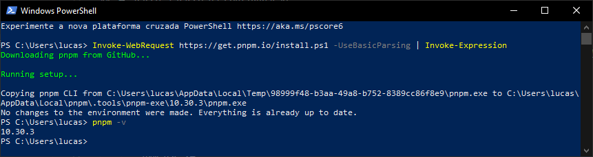

### 2. Inicialização do Projeto
Iniciei o projeto com o `pnpm` para gerar o `package.json` base.
```bash
    pnpm init
```
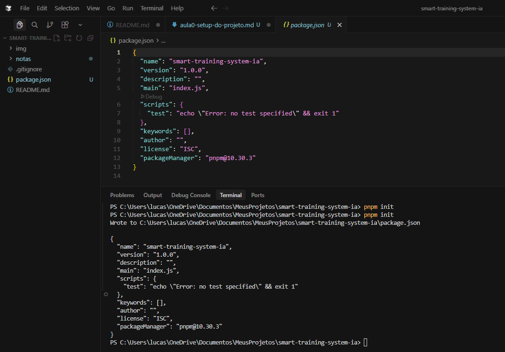

### 3. Configuração do TypeScript e Tipagem
Instalei o TypeScript e as definições de tipo para o Node.js como dependências de desenvolvimento.

```Bash
    pnpm add typescript@5.9.3 @types/node@24 -D
```
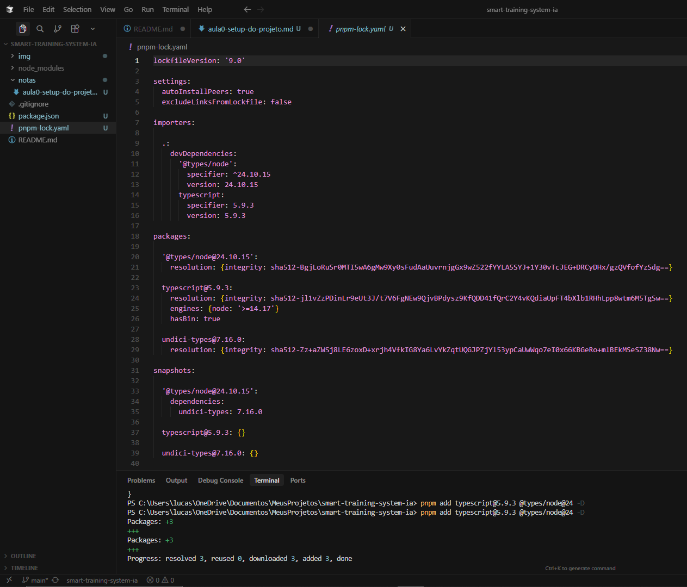

### 4. Ferramentas de Qualidade de Código (Linting & Formatting)
Para manter o código padronizado e evitar erros comuns, configurei o ESLint e o Prettier.

```Bash
    pnpm add prettier@3.8.1 eslint@9.39.2 -D
```
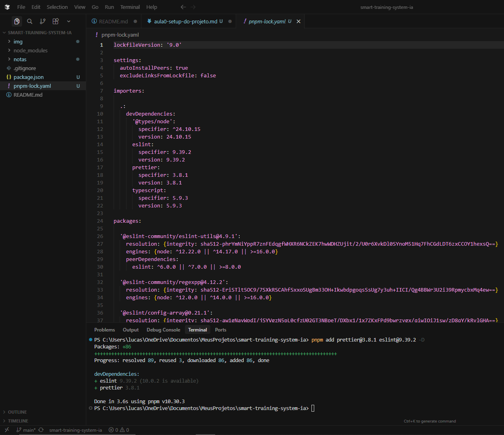

### 5. Inicialização do `tsconfig.json`
Gerei o arquivo de configuração do compilador TS com foco em performance (`target: es2024`) e rigor técnico (`strict: true`).

```Bash
    npx tsc --init
```

> Copie e cole esse código subistituindo o existente no arquivo `tsconfig.json`:
```json
{
  "$schema": "https://json.schemastore.org/tsconfig",
  "compilerOptions": {
    "module": "nodenext",
    "moduleResolution": "nodenext",
    "target": "es2024",
    "skipLibCheck": true,
    "strict": true,
    "outDir": "./dist"
  },
  "include": ["src"]
}
```
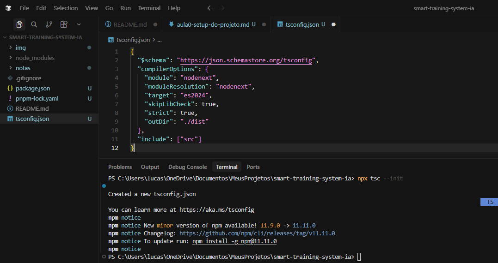

### 6. Configurar o Servidor de Desemvolvimento
```bash
    pnpm add tsx @4.21.0
``` 

## ⚙ Padronização de Ambiente e Motores (Engines)
Para garantir que todos os desenvolvedores utilizem exatamente a mesma versão do Node.js, configurei uma trava de segurança no projeto.

- Definição de Engines: No `package.json`, adicionei o campo `"engines"` especificando a versão `24.x` do Node.
- Configuração do `.npmrc`: Criei o arquivo `.npmrc` com a instrução `engine-strict=true`. Isso força o gerenciador de pacotes a interromper a instalação caso a versão do Node esteja incorreta.
- Validação na Prática: Realizei um teste tentando usar o Node `v22.20.0`, o que resultou no erro `ERR_PNPM_UNSUPPORTED_ENGINE`, comprovando que a trava está funcionando.

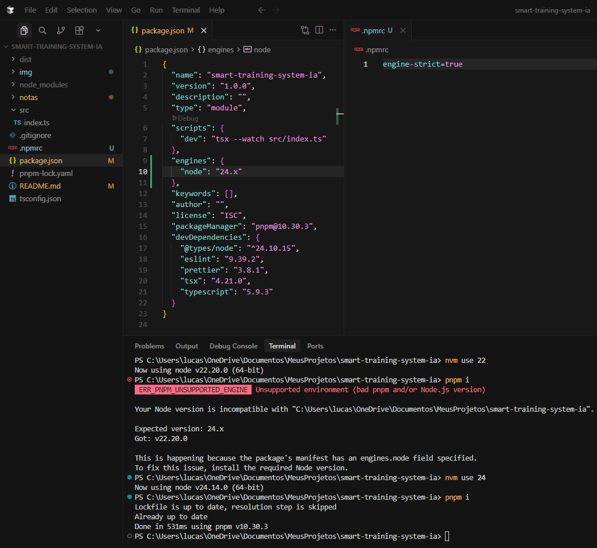

## 🔌 Desenvolvimento da API com Fastify e Segurança de Ambiente
Nesta etapa, o foco foi transformar o servidor básico em uma API estruturada, utilizando boas práticas de configuração para garantir que dados sensíveis (como portas e chaves de IA futuramente) não fiquem expostos no código.

### Implementação do Fastify
Instalei e configurei o **Fastify**, aproveitando seu sistema de logs nativo para monitorar as requisições em tempo real. [Site](https://fastify.dev/)
```bash
    pnpm add fastify@5.7.4
``` 

- **Primeiro Endpoint:** Criei uma rota `GET` na raiz (`/`) que retorna um objeto JSON `{ "hello": "world" }`, servindo como teste de conectividade da API.
- **Monitoramento:** Ativei o `logger: true` na instância do Fastify, o que permite visualizar detalhes de cada requisição (método, URL, endereço remoto) diretamente no terminal.

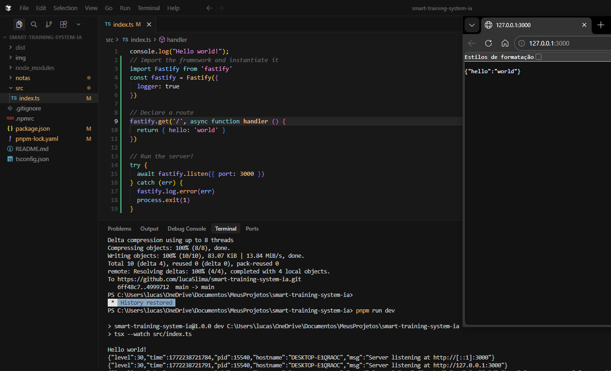

## Gestão de Variáveis de Ambiente (`.env`)
Para seguir padrões profissionais de desenvolvimento (12-Factor App), implementei o gerenciamento de configurações via arquivos `.env`. [Site](https://www.npmjs.com/package/dotenv)

1. **Instalação do Dotenv:** Adicionei a biblioteca `dotenv@17.3.1` para carregar as variáveis do arquivo `.env` para o `process.env` do Node.js.
    ```bash
        pnpm add dotenv@17.3.1
    ``` 
2. **Configuração Dinâmica:** Substituí a porta fixa no código por uma variável de ambiente: `Number(process.env.PORT) || 3000`.

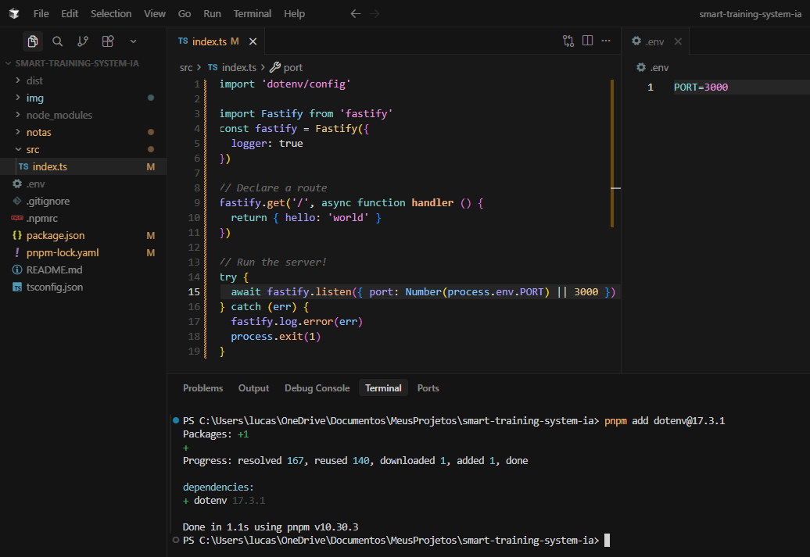
**Segurança:** O uso do `.env` permite que informações sensíveis sejam configuradas de forma distinta entre o ambiente de desenvolvimento (sua máquina) e o de produção.

## Validação de Dados e Tipagem Avançada com ZOD 
Para tornar a API do **Fit.AI** robusta e à prova de erros, implementei uma camada de validação de esquemas e provedores de tipos.
[Site](https://zod.dev/)

- **Integração com Zod:** Instalei as bibliotecas `zod@4.3.6` e `fastify-type-provider-zod@6.1.0`. O Zod permite definir exatamente o formato dos dados que a API deve receber e enviar.
    ```bash
        pnpm add zod@4.3.6 fastify-type-provider-zod@6.1.0
    ``` 
- **Type Provider:** Configurei o `ZodTypeProvider` no Fastify. Isso garante que o TypeScript entenda automaticamente o formato da resposta, oferecendo autocompletar e segurança de tipos (Type Safety) durante o desenvolvimento.
[Site](https://github.com/turkerdev/fastify-type-provider-zod)
- **Serialização e Validação:** Implementei o `setValidatorCompiler` e o `setSerializerCompiler`. Agora, se a API tentar retornar um dado que não segue o contrato definido, o Fastify emitirá um erro antes mesmo da resposta sair, garantindo a integridade dos dados.
- **Documentação Automática:** A estrutura de `schema` dentro da rota (com `description`, `tags` e `response`) prepara a base para a geração automática de documentação via Swagger/OpenAPI.
```ts
    import "dotenv/config";

    import Fastify from "fastify";
    import {
    serializerCompiler,
    validatorCompiler,
    ZodTypeProvider,
    } from "fastify-type-provider-zod";
    import z from "zod";

    const app = Fastify({
    logger: true,
    });

    app.setValidatorCompiler(validatorCompiler);
    app.setSerializerCompiler(serializerCompiler);

    app.withTypeProvider<ZodTypeProvider>().route({
    method: "GET",
    url: "/",
    schema: {
        description: "Hello world",
        tags: ["Hello World"],
        response: {
        200: z.object({
            message: z.string(),
        }),
        },
    },
    handler: () => {
        return {
        message: "Hello World",
        };
    },
    });

    try {
    await app.listen({ port: Number(process.env.PORT) || 8081 });
    } catch (err) {
    app.log.error(err);
    process.exit(1);
    }
``` 

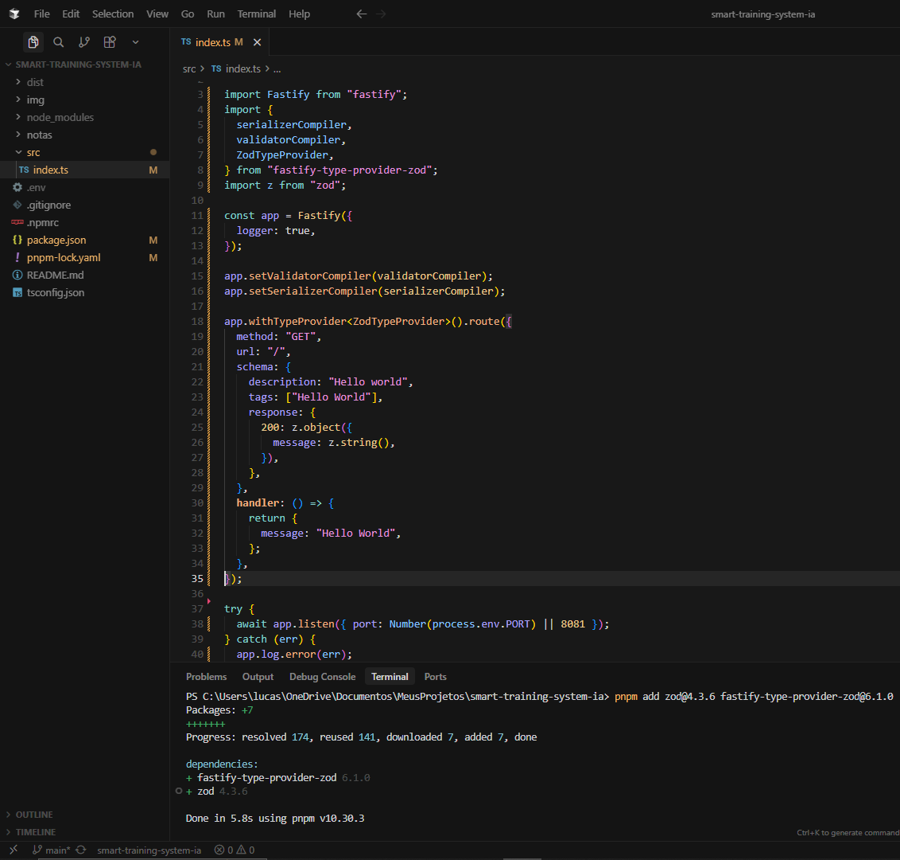

## Automação de Documentação com Swagger e OpenAPI
Para facilitar o consumo da API do **Fit.AI** e permitir testes rápidos dos endpoints, implementei a documentação interativa utilizando o padrão OpenAPI 3.0.
- **Integração com Swagger:** Instalei os pacotes `@fastify/swagger@9.7.0` e `@fastify/swagger-ui@5.2.5`.
    ```bash
        pnpm add @fastify/swagger@9.7.0 @fastify/swagger-ui@5.2.5
    ```
- **Configuração do OpenAPI:** Registrei o plugin `fastifySwagger`, definindo metadados como o título "Treinos API", versão "1.0.0" e a descrição técnica do projeto.
```ts
    import fastifySwagger from "@fastify/swagger";
    import fastifySwaggerUI from "@fastify/swagger-ui";    
```
- **Transformação de Tipos:** Utilizei a função `jsonSchemaTransform` para integrar automaticamente os esquemas de validação do **Zod** com a documentação do Swagger. Isso garante que a documentação esteja sempre sincronizada com o código real da aplicação.
```ts
    jsonSchemaTransform,
```
```ts
await app.register(fastifySwagger, {
  openapi: {
    info: {
      title: "Bootcamp Treinos API",
      description: "API para o bootcamp de treinos do FSC",
      version: "1.0.0",
    },
    servers: [
      {
        description: "Localhost",
        url: "http://localhost:8081",
      },
    ],
  },
  transform: jsonSchemaTransform,
});

await app.register(fastifySwaggerUI, {
  routePrefix: "/docs",
});
```
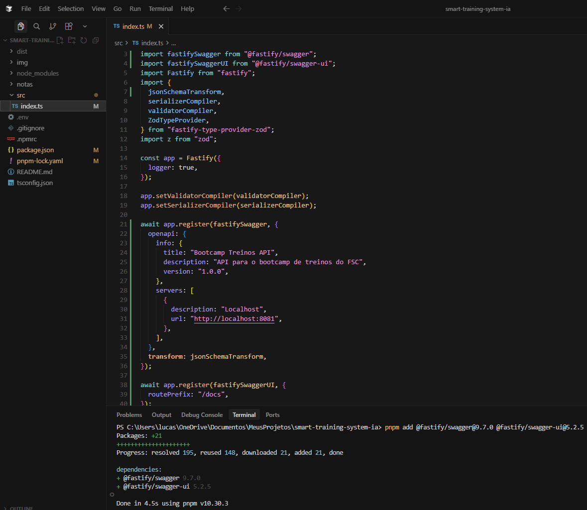
- **Interface Gráfica (Swagger UI):** Configurei o endpoint `/docs` para servir a interface visual do Swagger. Isso permite que qualquer pessoa visualize as rotas disponíveis, os esquemas de dados e até execute requisições de teste diretamente pelo navegador.

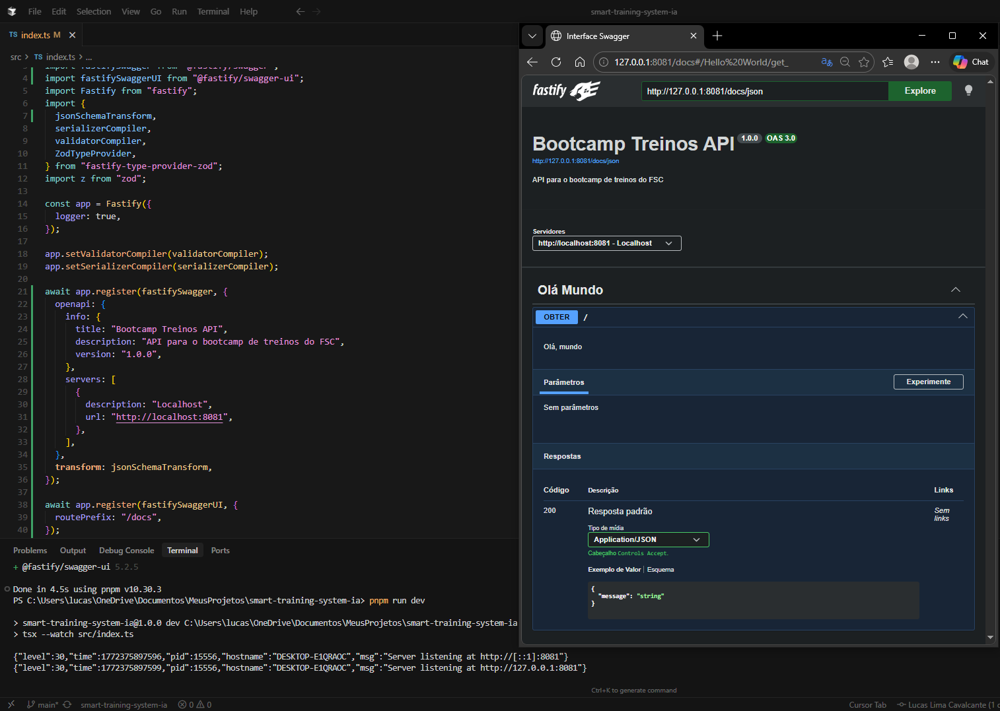

## 💾 Persistência de Dados e Infraestrutura
Nesta etapa, configurei a camada de banco de dados do **Fit.AI**, focando em produtividade, tipagem segura e isolamento de ambiente.

### 1. Modelagem com Prisma ORM
Escolhi o **Prisma** como ORM (Object-Relational Mapping) pela sua integração perfeita com o TypeScript.

- **Instalação**: Adicionei o `@prisma/client` e o CLI do `prisma` para gerenciar as migrações e o esquema.
    ```bash
        pnpm add @prisma/client@7.4.0 @prisma/adapter-pg@7.4.0
    ``` 
    ```bash
        pnpm add prisma@7.4.0 -D
    ``` 
    ```bash
        npx prisma init
    ``` 
    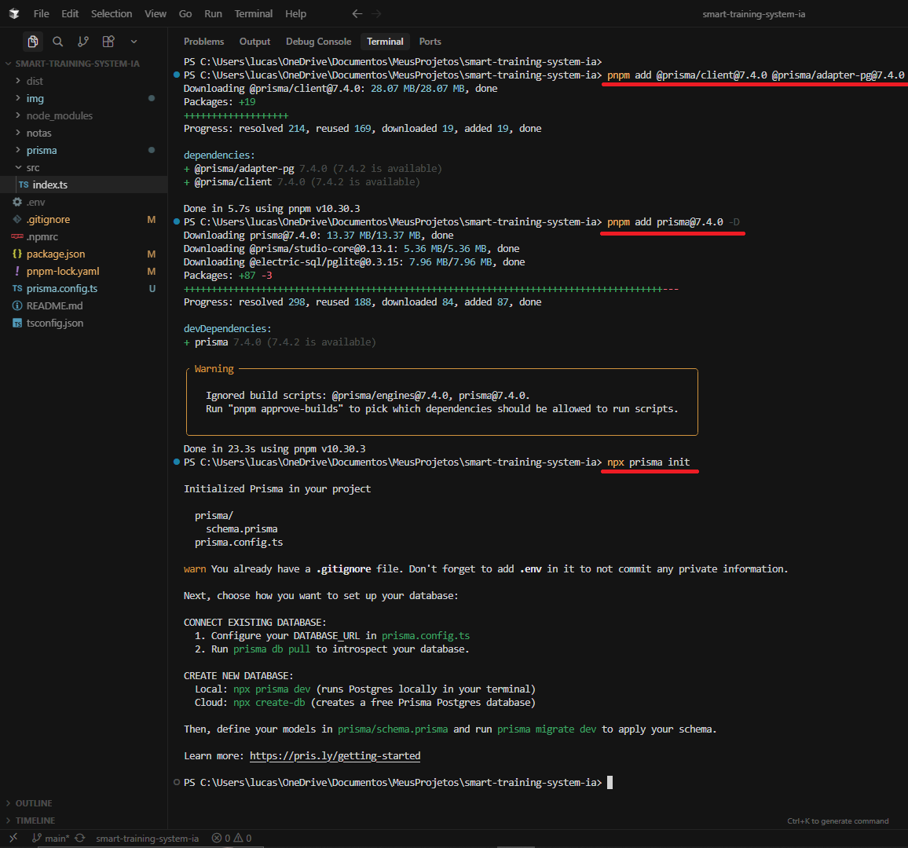

    Resultado: Gerou o arquivo `schema.prima` e add o `DATABASE_URL`, para melhor visualização instalei a extensão do **Prisma**
    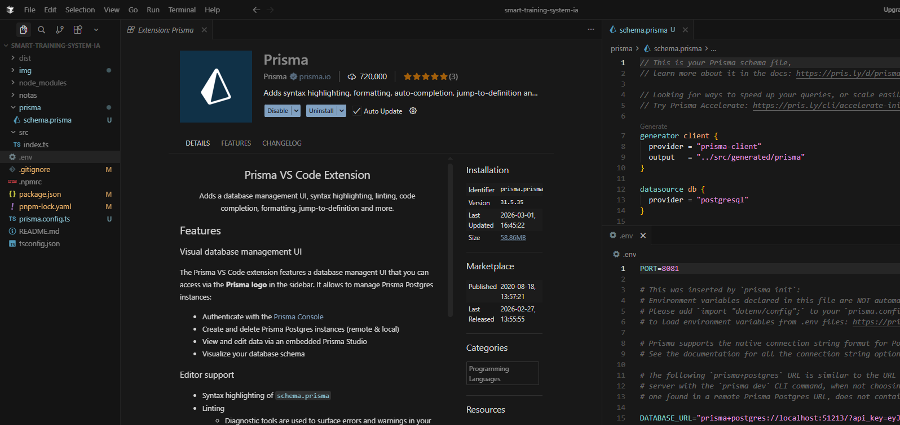
- **Esquema Relacional**: Desenvolvi o `schema.prisma` com as entidades principais:
    - **WorkoutPlan**: Plano mestre vinculado a um usuário.
    - **WorkoutDay**: Dias da semana (utilizando `enum WeekDay`).
    - **WorkoutExercise**: Detalhes dos exercícios (séries, repetições, tempo de descanso).
    ```ts
        generator client {
        provider = "prisma-client"
        output   = "../src/generated/prisma"
        }

        datasource db {
        provider = "postgresql"
        }

        model User {
        id           String @id @default(uuid())
        workoutPlans WorkoutPlan[]
        }

        model WorkoutPlan {
        id          String @id @default(uuid())
        name        String
        userId      String
        user        User @relation(fields: [userId], references: [id])
        workoutDays WorkoutDay[]
        isActive Boolean @default(true)
        createdAt DateTime @default(now())
        updatedAt DateTime @updatedAt
        }

        enum WeekDay {
        MONDAY
        TUESDAY
        WEDNESDAY
        THURSDAY
        FRIDAY
        SATURDAY
        SUNDAY
        }

        model WorkoutDay {
        id            String @id @default(uuid())
        name          String
        workoutPlanId String
        workoutPlan WorkoutPlan @relation(fields: [workoutPlanId], references: [id])
        isRest  Boolean @default(false)
        weekDay WeekDay
        exercises WorkoutExercise[]
        createdAt DateTime @default(now())
        updatedAt DateTime @updatedAt
        }

        model WorkoutExercise {
        id    String @id @default(uuid())
        name  String
        order Int
        workoutDayId String
        workoutDay WorkoutDay @relation(fields: [workoutDayId], references: [id])
        sets Int
        reps Int
        restTimeInSeconds Int
        createdAt DateTime @default(now())
        updatedAt DateTime @updatedAt
        }
    ``` 
- **Relacionamentos**: Implementei relações de `1:N` entre Planos, Dias e Exercícios, garantindo a integridade referencial.
    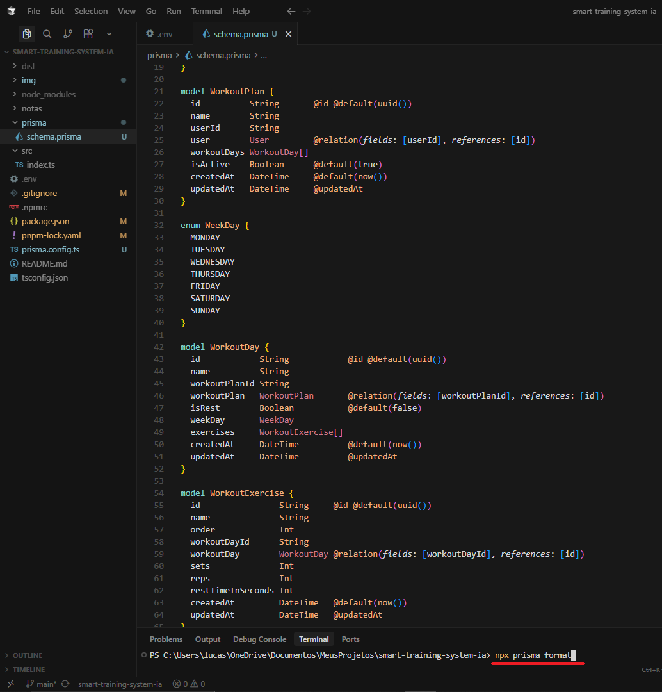 
    > Use o comando `npx prisma format` para formatar o arquivo

### 2. Infraestrutura com Docker e PostgreSQL
Para garantir que o banco de dados seja idêntico em qualquer ambiente de desenvolvimento, utilizei o **Docker Compose**.
- **PostgreSQL 16**: Implementei um container rodando a imagem oficial do Postgres Alpine (leve e segura).
- **Orquestração**: Criei o arquivo `docker-compose.yml` para gerencia automaticamente as variáveis de ambiente (`POSTGRES_USER`, `POSTGRES_DB`) e o mapeamento de portas (`5432`).
    ```yml
        services:
          postgres:
            image: postgres:16-alpine
            container_name: treinos-api-postgres
            environment:
              POSTGRES_USER: postgres
              POSTGRES_PASSWORD: password
              POSTGRES_DB: treinos-api
            ports:
              - "5432:5432"
            volumes:
              - postgres_data:/var/lib/postgresql/data

        volumes:
          postgres_data:    
  ``` 
- **Volumes**: Configurei volumes para garantir que os dados dos treinos não sejam perdidos ao reiniciar os containers.
    ```bash
        docker compose up -d
    ``` 
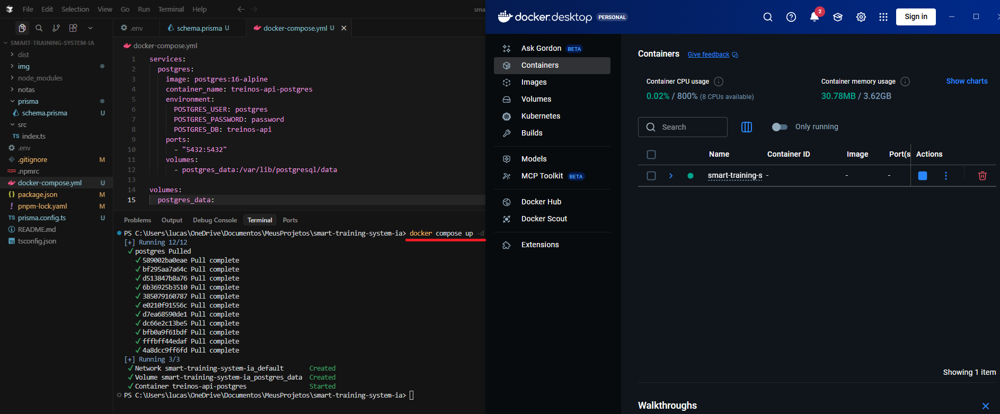

### 3. Sincronização e Gerenciamento
- **Prisma DB Push**: Comando para sincronizar meu modelo diretamente com o container do Postgres de forma ágil durante o desenvolvimento.
    ```bash
        npx prisma db push
    ``` 
- **Prisma Studio**: Ativei a interface visual do Prisma para explorar os dados e validar as inserções sem precisar de comandos SQL manuais.
    ```bash
        npx prisma studio
    ``` 

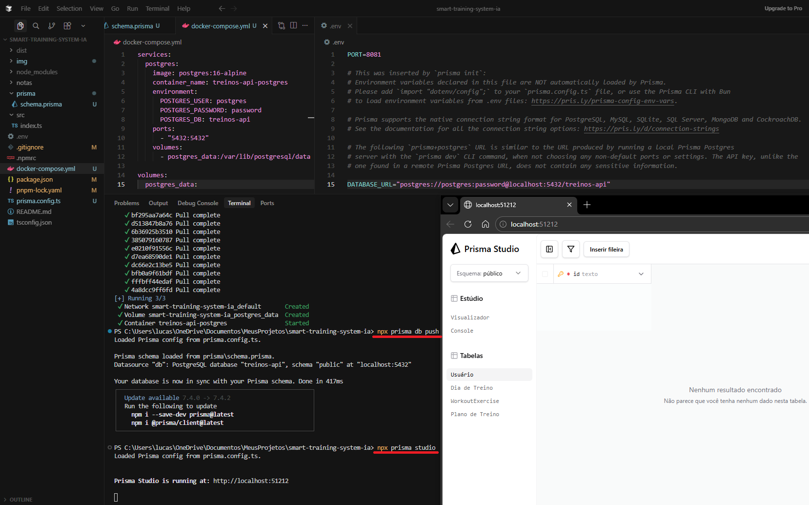

## 🔐 Autenticação com [Better Auth](https://better-auth.com/docs/installation)
Para gerenciar o acesso ao **Fit.AI**, implementei o [Better Auth](https://better-auth.com/docs/installation), uma solução de autenticação agnóstica de framework que se integra perfeitamente ao ecossistema TypeScript e ao Prisma ORM.

### 1. Configuração e Instalação
Iniciei o processo instalando a biblioteca principal e as dependências de integração.

- **Instalação**: Utilizei o comando 
    ```bash
        pnpm add better-auth@1.4.18
    ```
- **Variáveis de Ambiente**: Configurei as chaves de segurança necessárias no arquivo `.env`, incluindo `BETTER_AUTH_SECRET` e `BETTER_AUTH_URL` apontando para a porta `8081`. Gere um `BETTER_AUTH_SECRET` no [Site](https://better-auth.com/docs/installation)
- Rode o comando para gerar os arquivos `src/generated`:
    ```bash
        npx prisma generete
    ```
- **Configuração da Instância**: Criei o arquivo `lib/auth.ts` configurando métodos de login por e-mail e senha (`emailAndPassword: { enabled: true }`) e defini as origens confiáveis (`trustedOrigins`) como `http://localhost:3000`. Copie e cole esse código:
    ```ts
        import { PrismaPg } from "@prisma/adapter-pg";
        import { betterAuth } from "better-auth";
        import { prismaAdapter } from "better-auth/adapters/prisma";
        import { openAPI } from "better-auth/plugins";

        import { PrismaClient } from "../generated/prisma/client.js";

        const prisma = new PrismaClient({
        adapter: new PrismaPg({ connectionString: process.env.DATABASE_URL }),
        });

        export const auth = betterAuth({
        trustedOrigins: ["http://localhost:3000"],
        emailAndPassword: {
            enabled: true,
        },
        database: prismaAdapter(prisma, {
            provider: "postgresql",
        }),
        plugins: [openAPI()],
        });
    ```
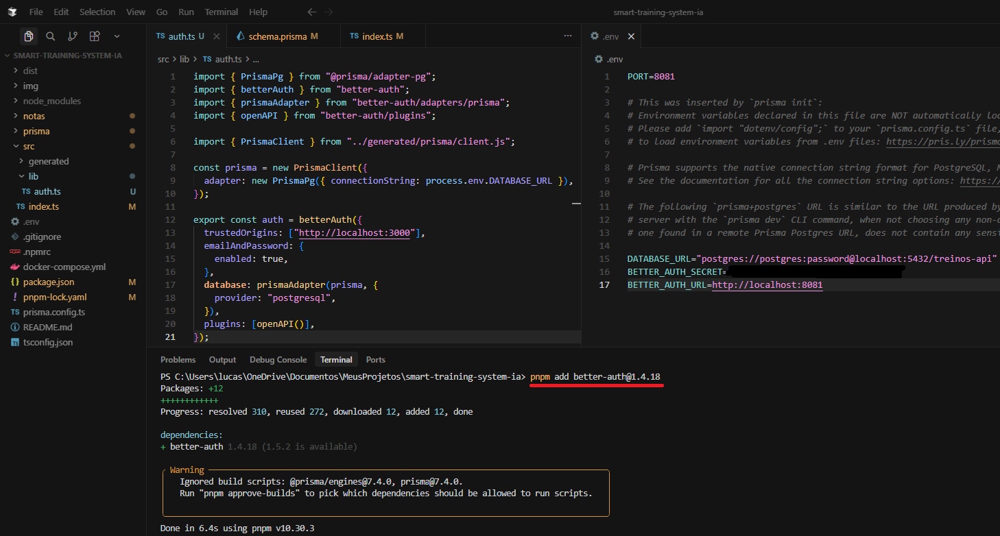
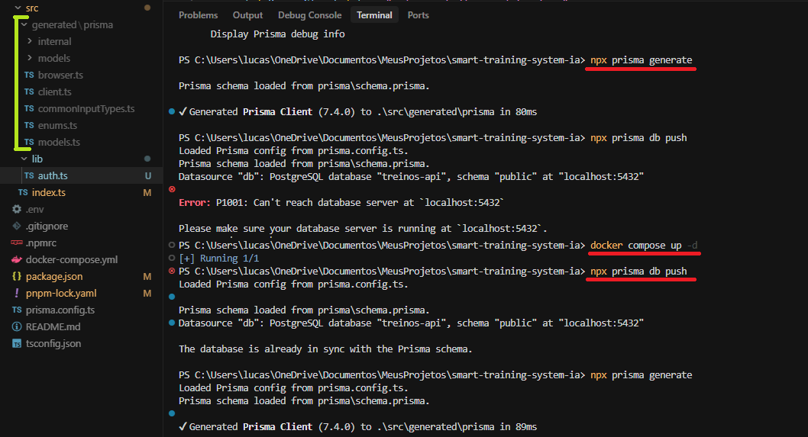
### 2. Integração com Prisma e Banco de Dados
O [Better Auth](https://better-auth.com/docs/installation) utiliza o banco de dados para persistir sessões e dados de usuário através de um adaptador.

- **Prisma Adapter**: Configurei o adaptador `prismaAdapter` apontando para a instância do `PrismaClient`.
- **Geração de Tabelas**: Utilizei a CLI do Better Auth para gerar automaticamente as tabelas necessárias no banco de dados.
    - **Resolução de Problemas**: Após enfrentar erros de versão na CLI, utilizei esse comando para garantir compatibilidade.
        ```bash
            npx @better-auth/cli@latest generate
        ```
    - **Sincronização**: O comando sobrescreveu o arquivo schema.prisma com as novas entidades (`User`, `Session`, `Account`, etc.) e em seguida executei esse comando para atualizar o cliente local.
        ```bash
            npx prisma generate 
        ```

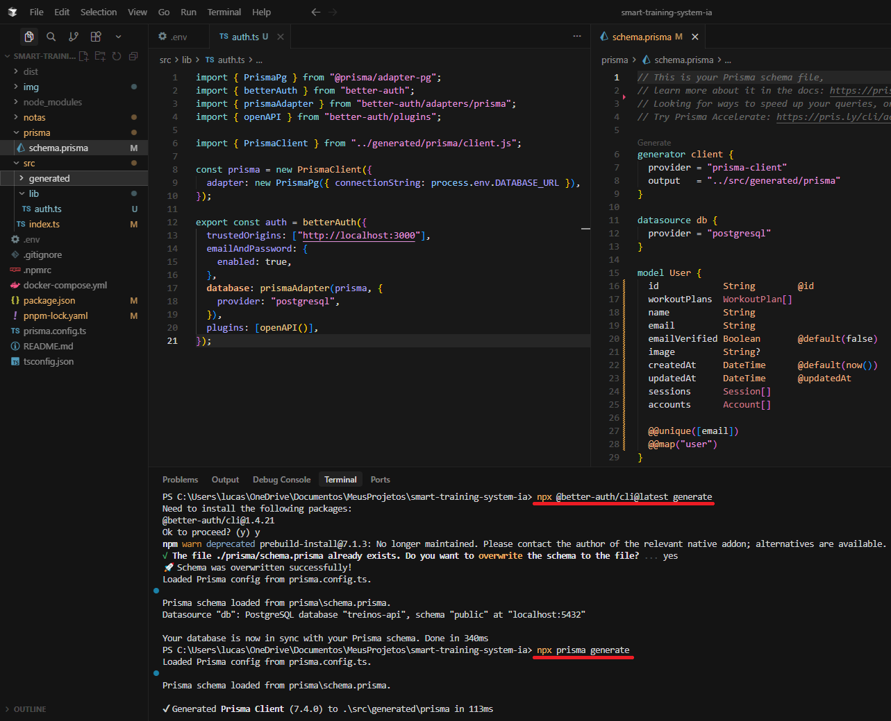
### 3. Configuração do Servidor e Segurança
Integrei a instância de autenticação no ponto de entrada da API. Acesse o [Site](https://better-auth.com/docs/integrations/fastify) para ter acesso a documentação mais detalhada

- **Política de CORS**: No arquivo `index.ts`, registrei o plugin `@fastify/cors` para permitir requisições seguras entre o front-end e o back-end, configurando explicitamente `credentials: true` para permitir o envio de cookies de sessão.
Comando para instalar o `@fastify/cors`
    ```bash
        pnpm add @fastify/cors@11.2.0
    ```
- **Integração OpenAPI**: Registrei o plugin `openAPI()` no [Better Auth](https://better-auth.com/docs/integrations/fastify) para que os endpoints de autenticação sejam automaticamente documentados no Swagger.
    ```ts
        await app.register(fastifyCors, {
        origin: ["http://localhost:3000"],
        credentials: true,
        });
    ```
- Copie e cole esse código no `index.ts`:
    ```ts
        app.route({
        method: ["GET", "POST"],
        url: "/api/auth/*",
        async handler(request, reply) {
            try {
            // Construct request URL
            const url = new URL(request.url, `http://${request.headers.host}`);

            // Convert Fastify headers to standard Headers object
            const headers = new Headers();
            Object.entries(request.headers).forEach(([key, value]) => {
                if (value) headers.append(key, value.toString());
            });
            // Create Fetch API-compatible request
            const req = new Request(url.toString(), {
                method: request.method,
                headers,
                ...(request.body ? { body: JSON.stringify(request.body) } : {}),
            });
            // Process authentication request
            const response = await auth.handler(req);
            // Forward response to client
            reply.status(response.status);
            response.headers.forEach((value, key) => reply.header(key, value));
            reply.send(response.body ? await response.text() : null);
            } catch (error) {
            app.log.error(error);
            reply.status(500).send({
                error: "Internal authentication error",
                code: "AUTH_FAILURE",
            });
        }
        },
        });
    ```
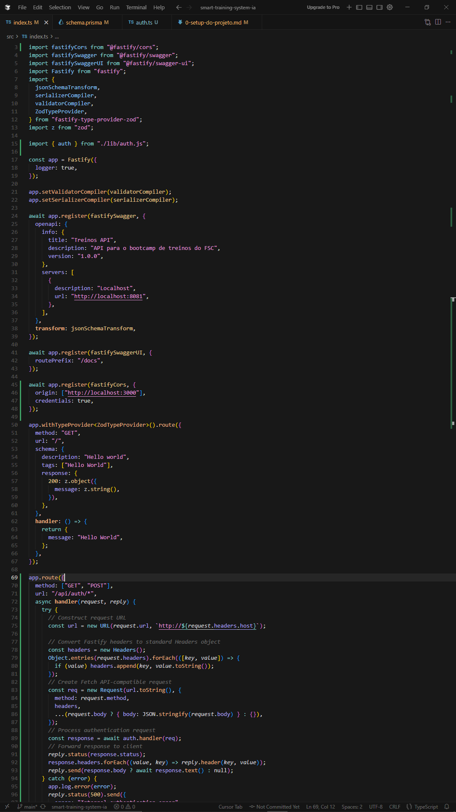

## 📝 Documentação Interativa e Moderna com [Scalar](https://github.com/scalar/scalar)
Para elevar o nível da experiência do desenvolvedor (DX) no **Fit.AI**, substituí a interface padrão do Swagger pelo [Scalar](https://github.com/scalar/scalar). Essa ferramenta oferece uma visualização mais limpa, snippets de código em diversas linguagens e um cliente HTTP integrado muito mais poderoso.

### 1. Instalação e Integração
Utilizei a biblioteca oficial para o ecossistema Fastify:

- **Comando**: 
    ```bash
        pnpm add @scalar/fastify-api-reference@1.44.20
    ```
    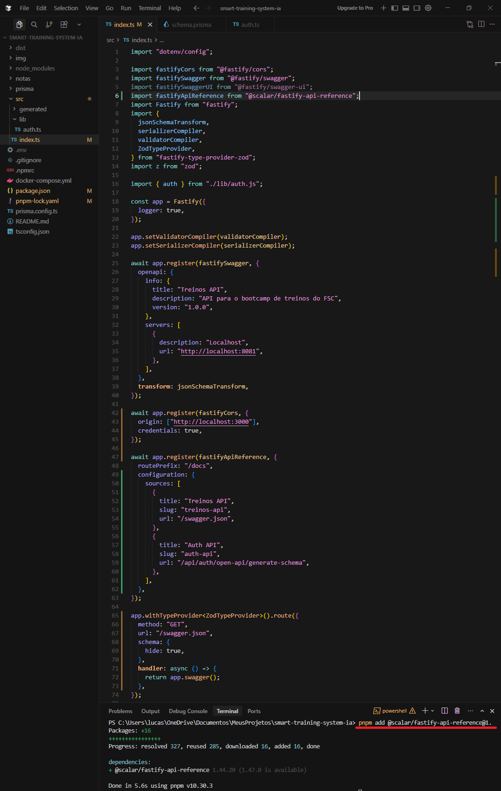
- **Implementação**: O plugin foi registrado no arquivo principal, configurado para servir a documentação na rota `/docs`.
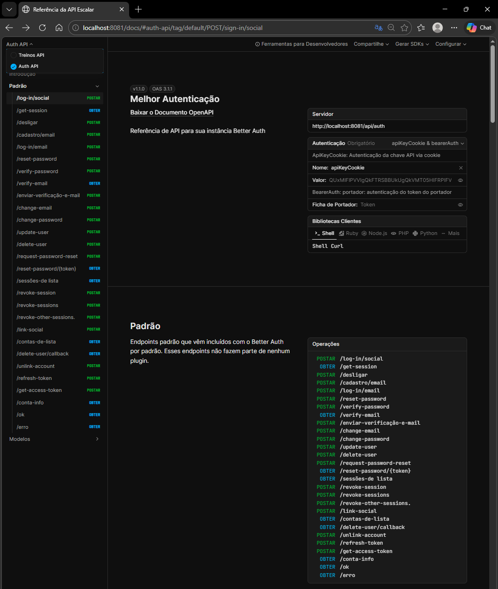

### 2. Arquitetura Multi-Fonte (Multi-source)
Um dos grandes diferenciais desta implementação foi a capacidade de consolidar diferentes contextos de API em uma única interface:

- **Treinos API**: Documentação da lógica de negócio (planos, exercícios, dashboard), consumindo o esquema gerado em `/swagger.json`.
- **Auth API**: Integração direta com os endpoints de autenticação do Better Auth, facilitando o teste de fluxos de login e sessão.

### 3. Funcionalidades de Destaque
- **Cliente HTTP Integrado**: Permite realizar requisições de teste diretamente da documentação com um console de resposta detalhado.
- **Snippets de Código**: Gera automaticamente exemplos de como consumir cada rota em linguagens como JavaScript (Fetch/Axios), Python, Go, entre outras.
- **Sincronização com Zod**: Como a API utiliza `fastify-type-provider-zod`, o Scalar exibe com precisão todos os campos obrigatórios, tipos de dados e validações de erro.

### 4. Teste
Teste de **cadastro de usuario** no sistema
- Certifique que o docker está rodando e execute com o comando:
    ```bash
        docker compose up -d
    ```
- Suba a API com o comando:
    ```bash
        pnpm run dev
    ```
- Cadastre um usuario no sistema
    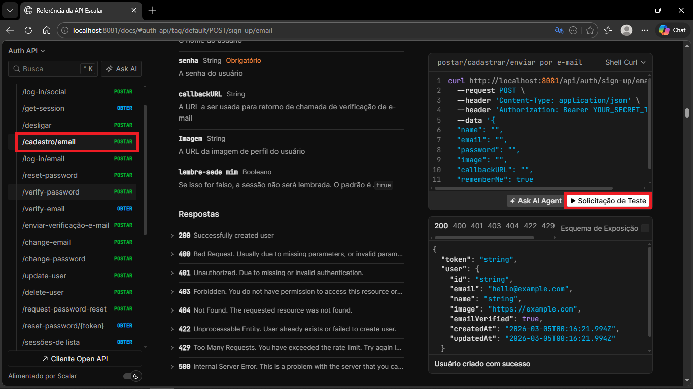
    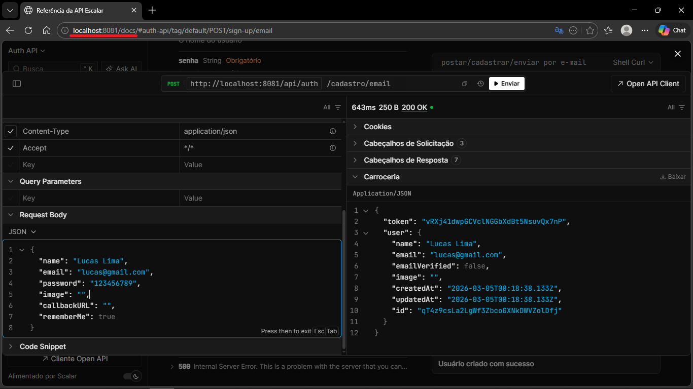
- Veja o cadastro no banco de dados
    ```bash
        npx prisma studio
    ```
    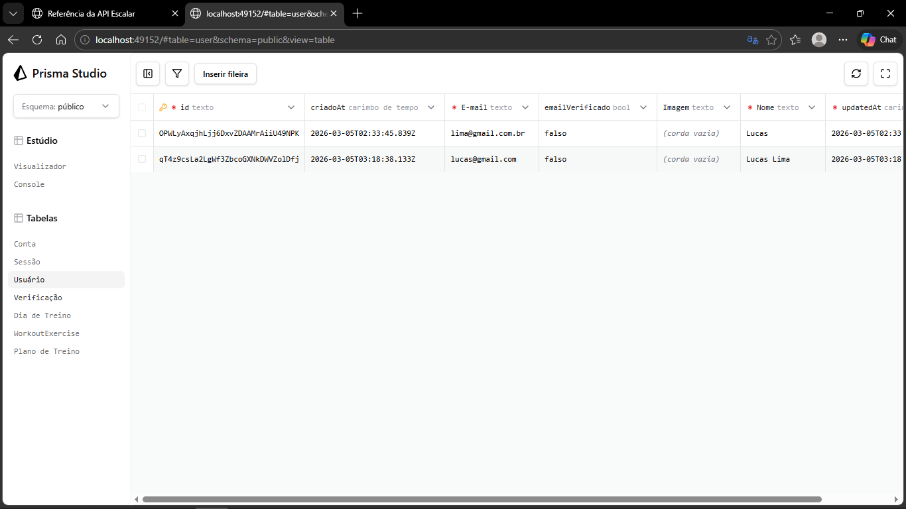